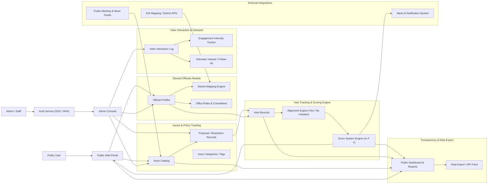

# Trident — Civic Engagement & Transparency Platform

Trident is a civic-tech platform designed to bring transparency, accountability, and public engagement to local government. It tracks elected officials, ballots, issues, votes and scorecards — delivering a public-facing dashboard for citizens and clean backend management tools for administrators, researchers, and civic organizations.

---

## 🌐 Vision & Purpose

Trident’s mission is to help communities:

- Monitor and track local government activity (issues, proposals, votes, resolutions).  
- Evaluate elected officials and legislative outcomes using a custom scoring system (A–F ±).  
- Provide a transparent, easily accessible public interface for civic data and voting records.  
- Facilitate data-driven civic engagement, public awareness, and accountability.  

This repo holds the core design, data models, prototype logic, and documentation for Trident’s platform architecture.

---

## 🔧 Features & Components

### **Core Modules**

- Issue & Proposal Catalog — track public matters, statuses, and metadata.  
- Elected Official Profiles — store office, committee, district, and voting history.  
- Voting & Score Engine — record votes, calculate alignment, generate scorecards (A–F ±).  
- District & Role Mapping — map officials to districts and roles (city, county, committees).  
- Voter Interaction Logging — track citizen engagement, feedback, and volunteer interest (optional module).  

### **Transparency & Public UX**

- Public Dashboard — view current issues, votes, scores, and official profiles.  
- Data Export — CSV / JSON exports for public or media use.  
- API Endpoints / Data Feeds — support for GIS mapping, external news/meeting feeds, integration with open-data portals.  

### **Admin & Governance Tools**

- Admin Console — for staff or civic groups to manage issues, proposals, and official records.  
- Audit Trail & Transparency Logs — full history of changes, votes, and metadata updates for accountability.  

---

## 🧱 Architecture Overview

---

📁 Repository Structure
bash
Copy code
/docs        → Design docs, data models, process specs  
/diagrams    → Architecture diagrams (Mermaid, PNGs, Figma exports)  
/src         → Prototype code, API schemas, frontend/back-end skeletons  
🛠️ What’s There Now (Stubbed)
Placeholder folders (docs, diagrams, src) ready for development

This README with full vision, feature list, and architecture overview

Mermaid diagram for visual architecture (above)

Data model sketching and planning ground

✅ Next Steps
Define schema: issue/official/vote data models in /docs

Build initial API endpoints / data layer (in /src) to support issue/official/vote CRUD

Build frontend skeleton (dashboard, issue list, official profile pages)

Set up GIS integration for district mapping and geo-visualization

Add audits, transparency logs, and data export features

📬 Contact & Contribution
This is a personal civic-tech project.
If you’re interested in collaborating, have feedback, or want to contribute:

Contact me via GitHub 

Review code or submit issues/pull requests anytime

⚡ Trident is a living project — this repo evolves as ideas turn into features and as data becomes available.
